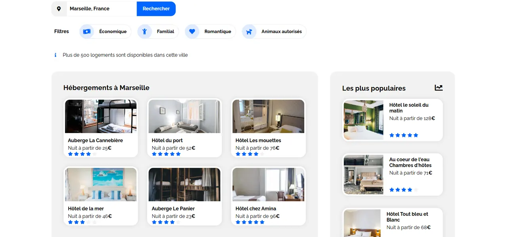
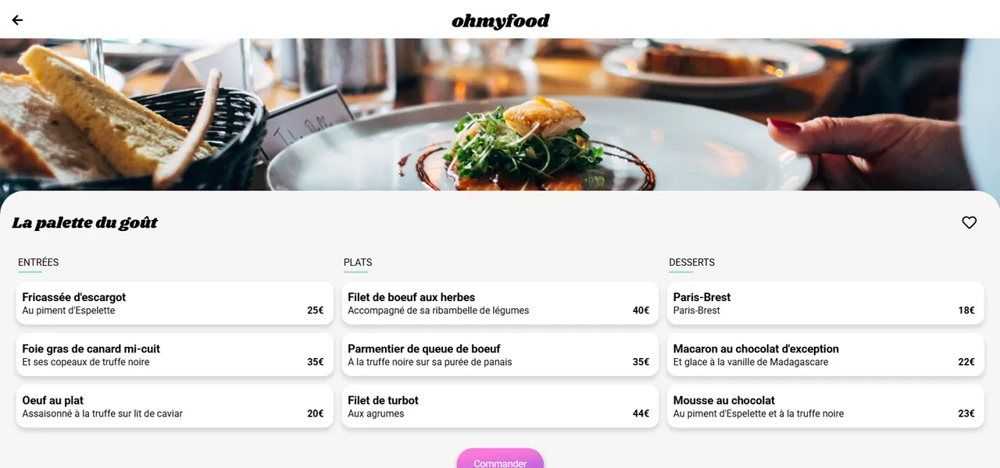
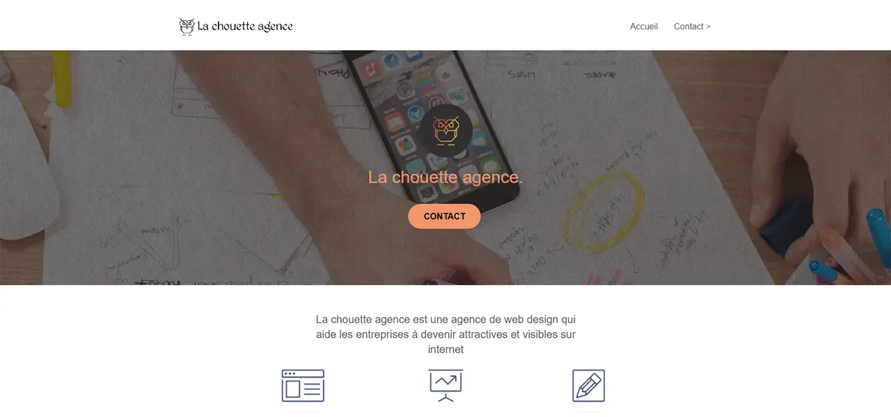
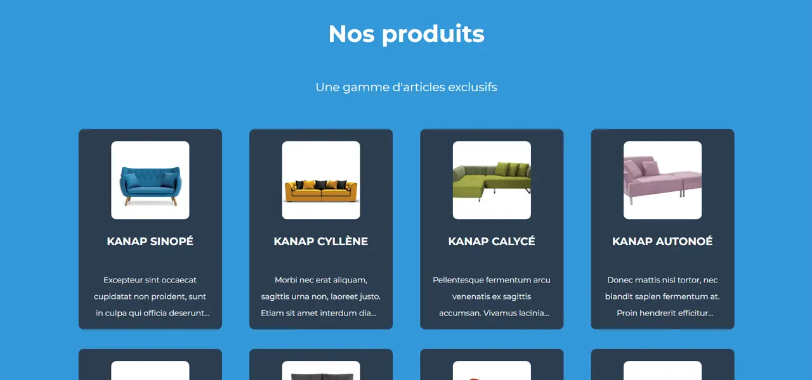
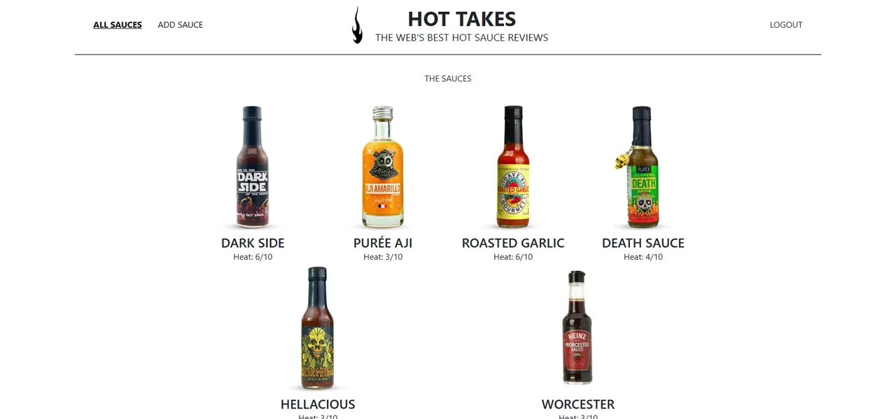
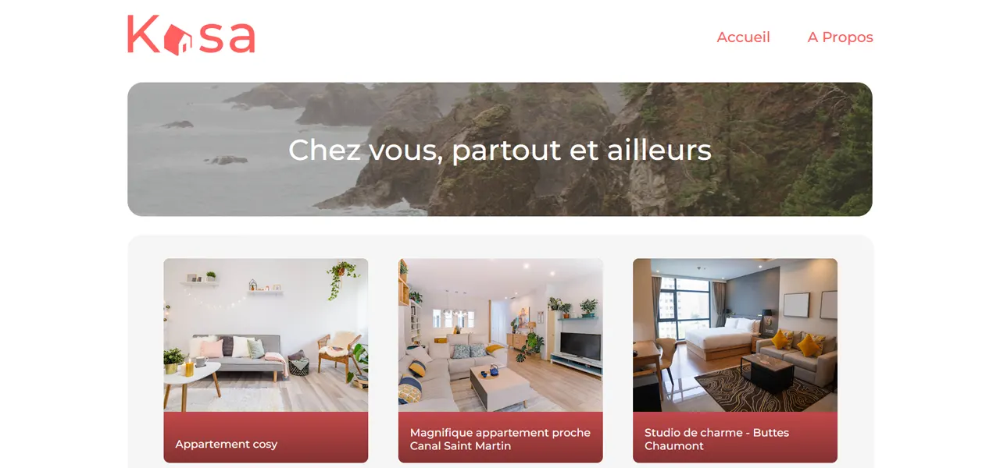
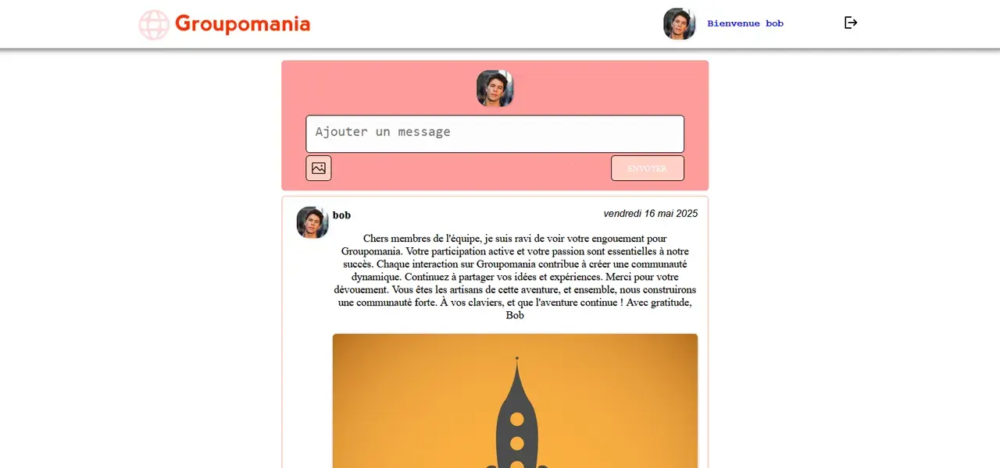
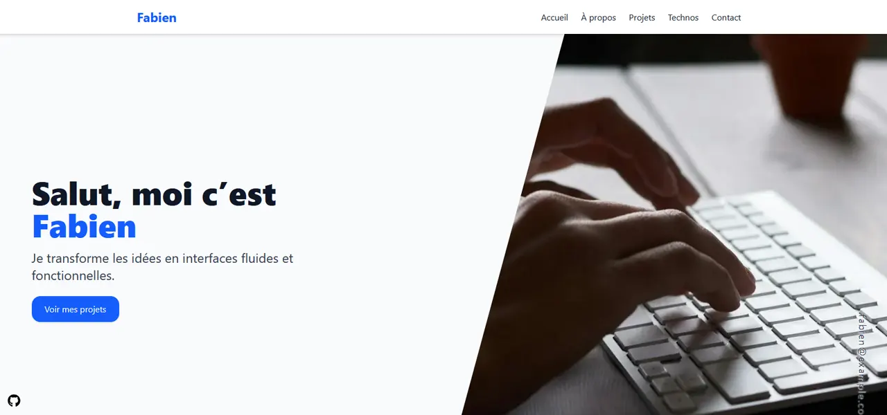
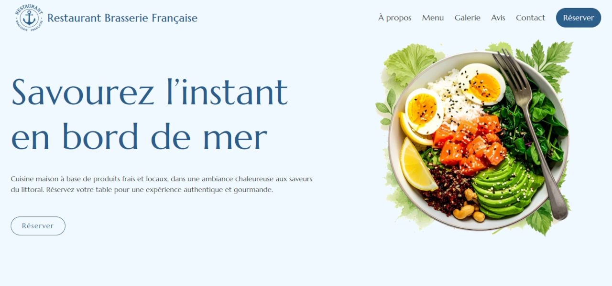
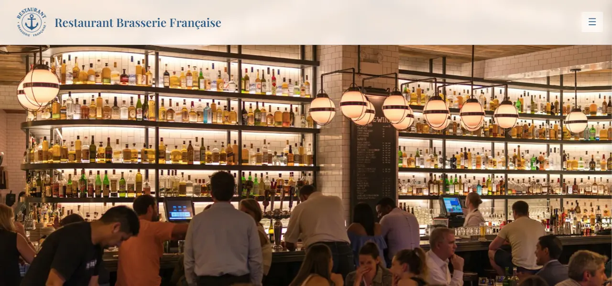

# Salut, moi c’est Fabien 👋

Développeur **React.js / Fullstack** passionné par la création d'applications modernes, performantes et accessibles.  

💻 **Tech Stack :**  

### Frontend

### Backend

### DevOps & Méthodologies

---

## 🌟 Projets

### Booki
  
Créez votre prochaine escapade en toute simplicité avec **Booki**, un site vitrine responsive permettant de rechercher des hébergements et activités par ville.  
**Tech:** HTML, CSS, Desktop First, GitHub Pages  
[Live Demo](https://mister2dev.github.io/Fabien_D_2_20012022/) | [GitHub](https://github.com/mister2dev/Fabien_D_2_20012022)

---

### Oh My Food
  
Explorez les menus gourmets de restaurants via un site en **mobile-first** avec animations CSS. Design moderne et fluide avec SASS.  
**Tech:** HTML, Sass, Mobile First, GitHub Pages  
[Live Demo](https://mister2dev.github.io/FabienD_3_15022022/) | [GitHub](https://github.com/mister2dev/FabienD_3_15022022)

---

### La Chouette Agence
  
Optimisation **SEO** et accessibilité (WCAG). Refonte d’un site d’agence web avec HTML/CSS clair et performant.  
**Tech:** HTML, CSS, SEO, WCAG, GitHub Pages  
[Live Demo](https://mister2dev.github.io/FabienD_4_19042022/) | [GitHub](https://github.com/mister2dev/FabienD_4_19042022)

---

### Kanap
  
Site e-commerce de vente de canapés avec **JavaScript pur** et API Node.js. Gestion du panier, validation des formulaires et interaction avec l’API.  
**Tech:** HTML, CSS, JavaScript, Node.js, API, Render  
[Live Demo](https://fabiend-5-23052022.onrender.com/) | [GitHub](https://github.com/mister2dev/FabienD_5_23052022)

---

### Piiquante
  
Plateforme de partage d’avis sur des sauces piquantes. Authentification JWT, MongoDB, IA pour modération (Perspective API & Clarifai).  
**Tech:** Angular, Node.js, MongoDB, API REST, JWT, Perspective API, Clarifai, Cloudinary, Render, Netlify  
[Live Demo](https://piiquante-hot-takes.netlify.app/) | [GitHub](https://github.com/mister2dev/FabienD_6_10102023)

---

### Kasa
  
Application de location d’appartements avec React et React Router. Interface dynamique, style SASS et déploiement GitHub Pages.  
**Tech:** React, React Router, Sass, GitHub Pages  
[Live Demo](https://mister2dev.github.io/kasa/) | [GitHub](https://github.com/mister2dev/kasa)

---

### Groupomania
  
Réseau social d’entreprise fullstack : Express, React, Node.js, PostgreSQL. Authentification sécurisée, upload d’images via Cloudinary et modération IA.  
**Tech:** React, Sass, Node.js, PostgreSQL, JWT, Express, Perspective API, Clarifai, Cloudinary, Render, Netlify  
[Live Demo](https://groupomania-demo.netlify.app) | [GitHub](https://github.com/mister2dev/Groupomania_demo)

---

### Portfolio
  
Portfolio personnel conçu avec React, Tailwind CSS et Framer Motion pour une navigation fluide.  
**Tech:** React, Tailwind CSS, Framer Motion, Vite, pnpm, Netlify  
[Live Demo](https://portfoliofab.netlify.app/)

---

### Restaurant Brasserie Française (Next.js)
  
Site vitrine responsive avec Next.js et Tailwind CSS, design épuré et navigation fluide.  
**Tech:** HTML, Next.js, Tailwind CSS, SEO, Vercel, Dark mode  
[Live Demo](https://restaurant-brasserie-francaise.vercel.app/) | [GitHub](https://github.com/mister2dev/next-app)

---

### Restaurant Brasserie Française (WordPress)
  
Site vitrine WordPress optimisé pour le SEO avec Elementor et design élégant.  
**Tech:** HTML, JavaScript, WordPress, Elementor, SEO  
[Live Demo](https://site-restauration.free.nf/)

---

💬 Toujours motivé à apprendre et à contribuer à des projets innovants !
